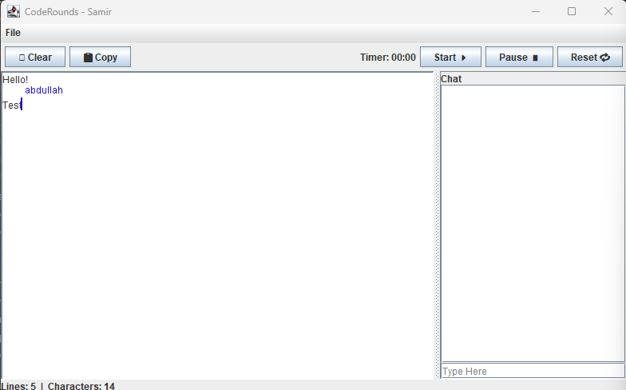

# 👨‍💻 CodeRounds
A real-time collaborative coding interview platform built in Java, designed to streamline remote technical interviews with features for both interviewers and interviewees.

---

## Project Information

This project enables interviewers and interviewees to collaborate in real-time during coding interviews. It offers the ability to share code in an editor, track cursors, communicate via chat, and includes a secure login system for managing users. The system is built using Java Sockets for client-server communication, Swing for the GUI, and a simple file system to save/load user code.

  

---

## How To Run

### Requirements
In order to run, you must have Java 23 or later installed on your system. Refer to the "Resources" section below for a link.

### Steps To Run
To run the application, follow these steps:
  1. In `src/main/java/`, locate `Server.java` in the `/server/` folder and `Client.java` in the `/client/` folder.
  2. First, compile and run `Server.java`. If this fails to run due to port 8080 being unavailable, refer to the "Troubleshooting" section below.
  3. Then, compile and run 2 or more instances of `Client.java`.
  4. Login screens will appear. Create a new account(s) or refer to `users.csv` for 2 premade accounts.
  5. Once both clients are logged in, the editor will appear on the left and the chat on the right. There will also be a dropdown menu named "File" in the top left to open and save files.

### Demonstration Of Functionality
The video below demonstrates and talks briefly about the different functions that our application performs.

### Troubleshooting
**Port unavailable/already in use:**
If the port being used by the program is already in use, there are 2 options:
  1. End the other process on your computer that is using port 8080.
  2. Change the port utilized by the application:
     - Go to line 9 in `Server.java` and change `private static final int PORT` to an available port on your machine.
     - Go to line 70 in `Client.java` and change the second parameter in `socket = new Socket("localhost", 8080);` to the port used in `Server.java`.
     - The ports in both files MUST match.

---

## Resources
Java 23: [Download Java 23](https://www.oracle.com/java/technologies/downloads/#java23)
